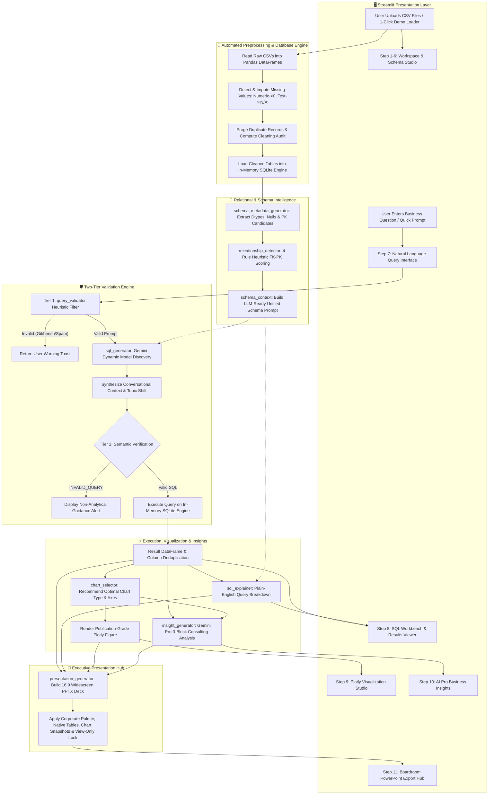

# ⚡ AI Data Analyst: Autonomous Multi-Table Intelligence Platform

> **An enterprise-grade, conversational data analysis platform that autonomously ingests messy multi-CSV datasets, cleans and models relational schemas, translates natural language into verified SQLite queries, generates publication-ready interactive visualizations, delivers executive strategic business insights, and exports boardroom-ready 16:9 PowerPoint briefing decks.**

---

## 📑 Table of Contents
1. [Executive Summary & Core Value Proposition](#-executive-summary--core-value-proposition)
2. [Complete System Architecture & Backend Flowchart](#-complete-system-architecture--backend-flowchart)
3. [Technology Stack & Frameworks](#-technology-stack--frameworks)
4. [End-to-End Workflow & Step-by-Step Pipeline](#-end-to-end-workflow--step-by-step-pipeline)
5. [Modular Backend Architecture](#-modular-backend-architecture)
6. [Repository Directory Structure](#-repository-directory-structure)
7. [Getting Started & Installation](#-getting-started--installation)
8. [Sample Datasets & Verification Scenarios](#-sample-datasets--verification-scenarios)
9. [Enterprise Capabilities & Security Highlights](#-enterprise-capabilities--security-highlights)

---

## 🚀 Executive Summary & Core Value Proposition

Modern businesses generate vast amounts of structured data spread across disparate CSV files and relational tables. Non-technical decision-makers often struggle to extract timely insights, while data engineering teams spend significant time writing boilerplate data cleaning scripts, manual SQL queries, dashboard charts, and presentation decks.

**AI Data Analyst** resolves this friction by automating the entire lifecycle of data analysis:
- 🧹 **Automated Data Quality & Imputation:** Ingests multiple raw CSV files, purges duplicates, imputes missing values based on data types (`0` for numeric, `'N/A'` for categorical), and logs detailed audit metrics.
- 🔗 **Heuristic Relationship & Schema Discovery:** Detects Foreign Key $\to$ Primary Key connections across tables without manual configuration, using column name matching, data type compatibility, uniqueness testing, and set-based value overlap analysis.
- 🧠 **Conversational NL-to-SQL with Semantic Memory:** Leverages Google Gemini Flash models to translate business questions into performant SQLite queries, handling conversational follow-ups, topic shifts, and fuzzy text matching.
- 🛡️ **Two-Tier Query Validation:** Protects against invalid inputs, keyboard mashing, and non-analytical prompts through instant local heuristic filters (Tier 1: 0ms latency) and LLM semantic validation (Tier 2).
- 📊 **Intelligent Plotly Visualization Studio:** Automatically selects the optimal chart type (Bar, Line, Donut/Pie, Scatter, Histogram) and renders interactive, styled Plotly charts complete with executive takeaway banners.
- 💡 **Executive Business Insights & Growth Actions (AI Pro):** Employs Gemini Pro models to deliver a structured 3-block consulting analysis (*The Big Picture*, *Where We Can Grow*, and *Action Plan* with bolded impact metrics).
- 💼 **Boardroom PowerPoint Presentation Export:** Synthesizes the analysis, data lineage, charts, and executive insights into a view-only protected, 16:9 widescreen `.pptx` deck.

---

## 🏗️ Complete System Architecture & Backend Flowchart

The following diagram illustrates the complete end-to-end pipeline from file ingestion to presentation delivery:



---

## 🛠️ Technology Stack & Frameworks

| Layer / Capability | Technology / Library | Version / Specification | Key Role & Responsibilities |
| :--- | :--- | :--- | :--- |
| **User Interface & App State** | **Streamlit** | `^1.30.0+` | Real-time reactive web application, multi-column layouts, tabbed navigation, responsive session state caching, download triggers. |
| **Data Ingestion & Cleaning** | **Pandas** | `^2.0.0+` | High-performance DataFrame ingestion, type-aware missing value imputation (`fillna`), exact duplicate purging, statistical profiling (`describe()`). |
| **Relational Database Engine** | **SQLite (`sqlite3`)** | Built-in Python standard library | High-speed, in-memory zero-latency relational SQL database (`:memory:` mode) with multi-threading support (`check_same_thread=False`). |
| **Generative AI Core** | **Google GenAI SDK** | `google-genai ^1.0.0+` | Autonomous multi-model discovery (Gemini Flash & Gemini Pro), deterministic low-temperature reasoning, structured JSON response enforcement. |
| **Data Visualization** | **Plotly Express & Graph Objects** | `plotly ^5.18.0+` | Interactive publication-grade web visuals (Bar, Spline Line, Donut/Pie, Scatter, Histogram) with custom luxury color palettes and tooltips. |
| **Presentation Generation** | **python-pptx** | `python-pptx ^0.6.21+` | Programmatic compilation of 16:9 widescreen boardroom presentation decks, native tables, styled cards, rich text runs, and view-only protection. |
| **Validation & Text Processing** | **Python `re` (Regex)** | Built-in Python standard library | Instant 0ms latency input sanitization, vowel-ratio heuristic checks, keyboard mashing detection, and markdown code fence extraction. |
| **Design System & Styling** | **Vanilla CSS & Keyframes** | Custom (`assets/style.css`) | Luxury dark/indigo glassmorphic aesthetic, floating KPI metric tiles, pulsating status indicators, and gradient banners. |

---

## 🔄 End-to-End Workflow & Step-by-Step Pipeline

The application execution lifecycle is structured into **11 sequential, modular steps**:

### Step 1: Page Configuration, Theme Styling & Asset Loading
- Configures Streamlit's page properties (wide layout, custom favicon, collapsed initial sidebar).
- Injects external CSS stylesheets from `assets/style.css` providing typography (`Plus Jakarta Sans`, `Inter`, `JetBrains Mono`), glassmorphic containers, and keyframe animations.

### Step 2: Executive Hero Header & Status Banner
- Renders the luxury header containing the brand title, active enterprise status badge, subtitle, and capability tags.

### Step 3: Session State Initialization & Workspace Setup
- Establishes persistent session state containers:
  - `datasets`: In-memory dictionary of `{table_name: DataFrame}`.
  - `cleaning_audit`: Preprocessing metrics and missing/duplicate row records.
  - `db_manager`: Active in-memory SQLite database instance.
  - `conversation_history`: Multi-turn question/SQL memory buffer.

### Step 4: Sample Datasets Showcase & 1-Click Demo Loader
- Displays metadata for pre-packaged sample files (`customers.csv`, `orders.csv`, `products.csv`).
- Provides individual CSV downloads and a **"⚡ Load All 3 Sample Datasets (1-Click)"** button for instant evaluation without manual file handling.

### Step 5: Multi-CSV File Upload & Automated Preprocessing Engine
- Accepts multiple simultaneous CSV uploads.
- Executes automated data cleaning:
  - **Numeric Nulls:** Imputed with `0`.
  - **Categorical / Text Nulls:** Imputed with `"N/A"`.
  - **Duplicates:** Purges identical rows while logging exact counts.

### Step 6: Interactive Data Quality Health & Relational Schema Studio
- Computes overarching KPI metric tiles: *Active Tables*, *Total Ingested Rows*, *Auto-Cleaned Values*, and *Total Features*.
- Renders an interactive 5-tab exploration studio:
  1. 📁 **Tables & Dimensions:** Row counts, column names, memory footprint.
  2. 🧹 **Data Quality Audit Log:** Before/after row counts, duplicate count, null count, and cleaning status.
  3. 🔍 **Interactive Data Explorer:** 10-row sample viewer and clean column data types.
  4. 📈 **Statistical Distributions:** Summary statistics generated via `df.describe()`.
  5. 🤖 **AI Schema Context:** Exact formatted schema string passed to the LLM.

### Step 7: Natural Language Query Interface & Two-Tier Validation
- Provides clickable quick-prompt inspiration pills and an interactive chat input.
- **Tier 1 Heuristic Validation:** Rejects empty prompts, short gibberish, repeated characters, low-vowel words, and common keyboard patterns with 0ms latency.
- **Schema Context Assembly:** Dynamically builds the multi-table schema representation.
- **AI SQL Generation:** Translates user intent into SQLite queries using dynamically discovered Gemini Flash models.
- **Tier 2 Semantic Validation:** Intercepts non-analytical or unanswerable queries (`INVALID_QUERY`).
- **Query Execution:** Executes SQL on the in-memory SQLite engine.
- **Conversational Memory:** Synthesizes standalone questions for follow-up questions and manages topic shifts.
- **SQL Explainer:** Generates a concise, plain-English breakdown of tables, joins, filters, and aggregations.

### Step 8: Render Active Query Results, Interactive SQL Workbench & Explanations
- Displays the active analysis question and multi-turn memory badge.
- Formats the executed SQL query block.
- Provides an **Interactive SQL Workbench** expander where users can edit SQL and execute modified queries in real time.
- Displays tabular query results with row/column counts and one-click CSV export.
- Renders the plain-English query explanation.

### Step 9: Intelligent Plotly Visualization Studio
- Gives users opt-in control (*"Yes, Generate AI Chart"* vs *"No, Table View is Enough"*).
- Uses Gemini to recommend the optimal chart type, X/Y axes, and color dimensions.
- Renders responsive Plotly visualizations (Bar, Line, Donut, Scatter, Histogram) with custom color sequences and executive conclusion takeaway banners.

### Step 10: Executive Business Insights & Strategic Growth Actions (AI Pro)
- On-demand button trigger avoids unnecessary token consumption until requested.
- Computes statistical profiles (describe, sums, distributions) and leverages Gemini Pro models.
- Generates a 3-block strategic consulting brief:
  - 💡 **The Big Picture:** Core takeaway with bolded key metrics.
  - 🚀 **Where We Can Grow:** Quantified business and revenue opportunities.
  - 🎯 **Action Plan:** Immediate tactical quick fixes and strategic initiatives.

### Step 11: Boardroom PowerPoint Presentation (`.pptx`) Export Hub
- Compiles all artifacts (query context, SQL lineage, tabular data, chart image, business insights) into an executive 16:9 widescreen presentation deck.
- Applies view-only protection and delivers a one-click `.pptx` download.

---

## 🧩 Modular Backend Architecture

```
AI data analyst/
├── app.py                              # Core Streamlit UI orchestration & application entry point
├── assets/
│   └── style.css                       # Luxury dark/indigo CSS design system & micro-animations
├── sample_datasets/                    # Built-in sample relational datasets
│   ├── customers.csv                   # 2,600 customer records (demographics, cities, states)
│   ├── orders.csv                      # 10,300 order records (dates, amounts, product/customer FKs)
│   └── products.csv                    # 215 product records (categories, prices, unit costs)
└── modules/                            # Modular AI and backend processing libraries
    ├── __init__.py                     # Package initializer
    ├── database_manager.py             # In-memory SQLite connection & query execution manager
    ├── schema_metadata_generator.py    # Schema inspection, null % calculation & candidate PK detection
    ├── releationship_detector.py       # Heuristic 4-rule FK-to-PK relationship detection engine
    ├── schema_context.py               # Formats tables, columns, and relationships into LLM prompts
    ├── query_validator.py              # Tier 1 fast heuristic input validation (gibberish/spam filter)
    ├── sql_generator.py                # Gemini NL-to-SQL generation, intent & conversational memory
    ├── sql_explainer.py                # Plain-English SQL explanation breakdown generator
    ├── chart_selector.py               # AI chart type selection & interactive Plotly rendering
    ├── insight_generator.py            # AI Pro strategic business insights & growth action generator
    └── presentation_generator.py       # Boardroom 16:9 widescreen PowerPoint deck (.pptx) compiler
```

### In-Depth Module Specifications

#### 1. `modules/database_manager.py`
- **Class:** `DatabaseManager(db_name=":memory:")`
- **Capabilities:**
  - Manages SQLite connection with `check_same_thread=False` for Streamlit thread safety.
  - `load_datasets(datasets)`: Converts DataFrames to SQLite tables (`if_exists="replace"`).
  - `execute_query(query)`: Executes SQL and automatically renames duplicate column names from joins (e.g. `customer_id`, `customer_id_1`).
  - `get_tables()`: Queries `sqlite_master` to retrieve active table names.

#### 2. `modules/releationship_detector.py`
- **Function:** `detect_table_releationship(datasets, minimum_confidence_score=60)`
- **Heuristic Scoring System (100-Point Scale):**
  1. **Same Column Name (`+40 pts`):** Direct match on column names across table pairs.
  2. **Compatible Data Types (`+20 pts`):** Validates numeric-to-numeric or text-to-text join compatibility.
  3. **Target Column is Candidate PK (`+20 pts`):** Confirms target column has zero nulls and 100% unique values.
  4. **High Value Overlap (`+20 pts`):** Computes set intersection ratio; awards points if overlap $\ge 80\%$.
- Categorizes relationships into `HIGH` ($\ge 80$) and `MEDIUM` ($60-79$) confidence levels.

#### 3. `modules/query_validator.py`
- **Function:** `is_meaningful_query(question)`
- **Heuristic Rules:**
  - Rule 1: Minimum character length ($\ge 3$ characters).
  - Rule 2: Alphabetical content check (rejects inputs without letters).
  - Rule 3: Character repetition spam detection (e.g. `"aaaaaa"`, `"asdfasdfasdf"`).
  - Rule 4: Vowel-to-character ratio check ($< 15\%$ vowels in words $\ge 5$ characters flags gibberish).
  - Rule 5: Keyboard mashing pattern matching (`"qwerty"`, `"asdfgh"`, `"zxcvbn"`).

#### 4. `modules/sql_generator.py`
- **Functions:** `generate_SQL_query(...)`, `synthesize_standalone_question(...)`
- **Capabilities:**
  - Dynamic discovery of latest available Gemini Flash models (`gemini-2.5-flash`, `gemini-1.5-flash`, etc.) with automatic fallbacks.
  - Multi-line clean SQL formatting (`FROM`, `JOIN`, `WHERE`, `GROUP BY`, `ORDER BY` on distinct lines).
  - Case-insensitive text filtering with `LIKE '%keyword%'` and singular root matching.
  - Automated placeholder filtering (`WHERE column != 'N/A'`).
  - Topic shift detection (`INTENT: FOLLOW_UP` vs `INTENT: NEW_TOPIC`).

#### 5. `modules/chart_selector.py`
- **Functions:** `recommend_chart_config(...)`, `generate_plotly_chart(...)`
- **Chart Selection Logic:**
  - **Line Chart:** Time-series trends, dates, months, growth trajectories.
  - **Bar Chart:** Categorical comparisons, top N rankings, grouped metrics.
  - **Pie / Donut Chart:** Share of total when categories $\le 5$.
  - **Scatter Plot:** Correlation between two numeric variables.
  - **Histogram:** Distribution of a single continuous variable.
  - **Table View:** Scalar counts or single-row outputs.

#### 6. `modules/insight_generator.py`
- **Function:** `generate_business_insights(...)`
- **Capabilities:**
  - Gathers statistical context (`describe()`, column sums, cardinality, sample records).
  - Prioritizes deep-reasoning Gemini Pro models.
  - Delivers a structured, high-impact 3-block advisory brief with bolded metrics.

#### 7. `modules/presentation_generator.py`
- **Function:** `create_powerpoint_deck(...)`
- **Capabilities:**
  - Compiles 16:9 widescreen slides with custom corporate color palette.
  - Parses markdown into rich text runs with bold highlights.
  - Injects native styled metric tables, SQL lineage cards, and high-resolution chart snapshots.
  - Applies write-protection flags for view-only security.

---

## 📂 Repository Directory Structure

```plaintext
AI Data analyzer/
├── AI data analyst/
│   ├── assets/
│   │   └── style.css
│   ├── modules/
│   │   ├── __init__.py
│   │   ├── chart_selector.py
│   │   ├── database_manager.py
│   │   ├── insight_generator.py
│   │   ├── presentation_generator.py
│   │   ├── query_validator.py
│   │   ├── releationship_detector.py
│   │   ├── schema_context.py
│   │   ├── schema_metadata_generator.py
│   │   ├── sql_explainer.py
│   │   └── sql_generator.py
│   ├── sample_datasets/
│   │   ├── customers.csv
│   │   ├── orders.csv
│   │   └── products.csv
│   ├── app.py
│   └── README.md
├── sample_datasets/
│   ├── customers.csv
│   ├── orders.csv
│   └── products.csv
└── README.md
```

---

## 🚀 Getting Started & Installation

### 1. Prerequisites
- **Python:** Version `3.10` or higher installed.
- **Google Gemini API Key:** Obtain an API key from [Google AI Studio](https://aistudio.google.com/).

### 2. Clone Repository & Set Up Virtual Environment
```bash
# Navigate to the project workspace directory
cd "AI Data analyzer"

# Create a virtual environment
python -m venv venv

# Activate the virtual environment
# On Windows (PowerShell):
.\venv\Scripts\Activate.ps1
# On macOS / Linux:
source venv/bin/activate
```

### 3. Install Dependencies
```bash
pip install streamlit pandas plotly google-genai python-pptx
```

### 4. Configure Gemini API Key
Set your Gemini API key in your environment:
```bash
# On Windows (PowerShell):
$env:GEMINI_API_KEY="your_actual_gemini_api_key_here"

# On Windows (Command Prompt):
set GEMINI_API_KEY=your_actual_gemini_api_key_here

# On macOS / Linux (bash/zsh):
export GEMINI_API_KEY="your_actual_gemini_api_key_here"
```

### 5. Launch Application
```bash
streamlit run "AI data analyst/app.py"
```
The application will launch locally at `http://localhost:8501`.

---

## 🧪 Sample Datasets & Verification Scenarios

You can verify the entire pipeline immediately using the built-in 1-Click Sample Dataset Loader:

| Scenario / Goal | Example User Question | Key Behaviors Verified |
| :--- | :--- | :--- |
| **Multi-Table Join & Aggregation** | *"What are the top 5 product categories by total sales?"* | Joins `orders` $\to$ `products`, aggregates revenue, ranks categories, renders horizontal/vertical bar chart with takeaway banner. |
| **Time-Series Analysis** | *"Show monthly revenue trends over time."* | Extracts month/date from `order_date`, computes trends, renders spline line chart with data markers. |
| **Conversational Follow-Up** | *"Now filter that for only 2024"* (after previous turn) | Detects `FOLLOW_UP` intent, modifies existing query with date filter, synthesizes standalone question for presentation. |
| **Topic Shift Detection** | *"Who are the top 5 highest spending customers?"* | Detects `NEW_TOPIC` intent, resets SQL from scratch, joins `customers` $\to$ `orders`, displays customer names and totals. |
| **Fuzzy Text Search** | *"How many air fryers have been sold?"* | Applies case-insensitive `LIKE '%air fryer%'` matching against `product_name`. |
| **Two-Tier Validation Check** | *"asdfghjkl"* or *"tell me a joke"* | Triggers Tier 1 heuristic filter or Tier 2 semantic verification without executing invalid SQL. |

---

## 🔒 Enterprise Capabilities & Security Highlights

- ⚡ **Zero-Persistence In-Memory Database:** Datasets are processed in volatile SQLite in-memory instances (`:memory:`); no sensitive uploaded records are written to permanent disk storage.
- 🧵 **Streamlit Multi-Thread Safe:** Explicit `check_same_thread=False` configuration ensures smooth concurrency across interactive sessions.
- 🛡️ **Two-Tier Prompt Sanitization:** Local regex validation stops malicious or wasteful API requests with zero latency before LLM invocations.
- 🔒 **Confidential Presentation Security:** PowerPoint presentations are generated with write-protection enabled to prevent accidental tampering during executive reviews.

---

## 📜 License
This project is open-source and available under the **MIT License**.
