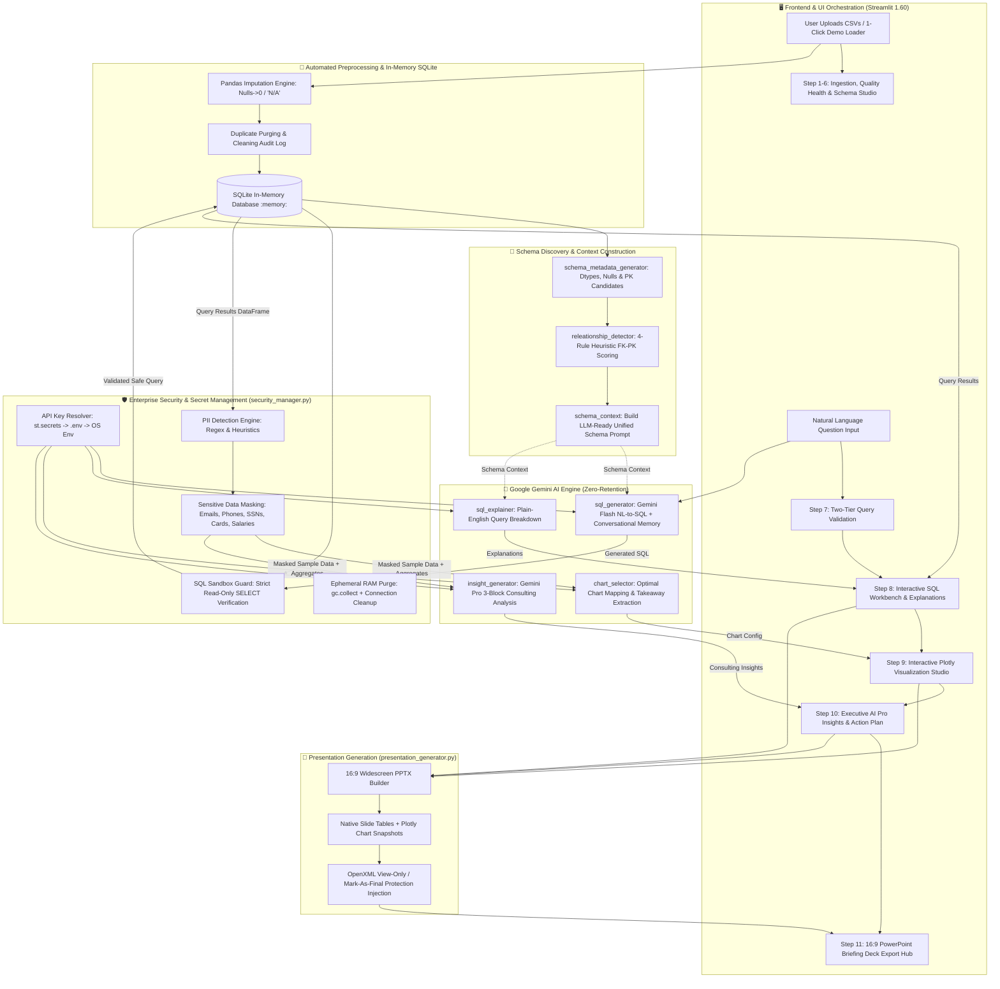

# ⚡ AI Data Analyst: Autonomous Enterprise Multi-Table Intelligence Platform

[](https://www.python.org/)
[](https://streamlit.io/)
[](https://ai.google.dev/)
[](https://www.sqlite.org/)
[](https://plotly.com/)
[](https://python-pptx.readthedocs.io/)
[-34D399.svg?logo=pytest&logoColor=white)](https://docs.pytest.org/)
[](#-enterprise-security-network-architecture--data-privacy)
[](#-api-key-protection--secret-management)

> **An autonomous, enterprise-grade data intelligence and analytics platform that ingests messy multi-CSV datasets, cleans and models relational schemas, translates natural language into verified SQLite queries, renders interactive Plotly visualizations, delivers executive strategic business insights, and exports boardroom-ready 16:9 PowerPoint briefing decks with built-in PII protection, API-key encryption, and zero-data-retention security.**

---

## 📑 Table of Contents
1. [Executive Summary & Core Value Proposition](#-executive-summary--core-value-proposition)
2. [End-to-End System Architecture](#-end-to-end-system-architecture)
3. [Technology Stack & Frameworks](#-technology-stack--frameworks)
4. [The 11-Step Application Workflow](#-the-11-step-application-workflow)
5. [Modular Backend Architecture](#-modular-backend-architecture)
6. [Enterprise Security, Network Architecture & Data Privacy](#-enterprise-security-network-architecture--data-privacy)
7. [API Key Protection & Secret Management](#-api-key-protection--secret-management)
8. [Automated Testing & Production Verification (287 Tests)](#-automated-testing--production-verification-287-tests)
9. [Sample Datasets Showcase](#-sample-datasets-showcase)
10. [Installation & Getting Started](#-installation--getting-started)
11. [Repository Directory Structure](#-repository-directory-structure)
12. [License & Security Policy](#-license--security-policy)

---

## 🚀 Executive Summary & Core Value Proposition

Modern organizations generate vast amounts of structured data across disparate CSV files and relational tables. Non-technical decision-makers often struggle to extract timely insights, while data engineering teams spend hours writing boilerplate cleaning scripts, crafting complex SQL queries, creating BI dashboards, and preparing executive briefing decks.

**AI Data Analyst** resolves this friction by automating the full end-to-end data intelligence lifecycle:
- 🧹 **Automated Data Quality & Preprocessing:** Ingests multiple raw CSV files, purges duplicates, imputes missing values based on data types (`0` for numeric, `'N/A'` for text), and records detailed audit health metrics.
- 🔗 **Heuristic Relational Discovery:** Discovers Foreign Key $\to$ Primary Key connections across tables without manual configuration, using column name matching, data type compatibility, uniqueness testing, and set-based value overlap scoring.
- 🧠 **Conversational NL-to-SQL with Semantic Memory:** Leverages Google Gemini models to translate business questions into optimized SQLite queries, handling multi-turn follow-ups, topic shifts, and fuzzy text matching.
- 🛡️ **Two-Tier Query & Security Sandboxing:** Protects against invalid inputs, keyboard mashing, and non-analytical prompts with 0ms Tier-1 heuristic filtering and Tier-2 semantic validation, while enforcing read-only SQL sandboxing (`SELECT` only).
- 🔒 **Enterprise PII & Privacy Shield:** Automatically detects and masks sensitive Personally Identifiable Information (emails, phone numbers, SSNs, credit cards, compensation, passwords) in previews and LLM prompts.
- 🔑 **Air-Tight API Key Protection:** Reads Gemini credentials safely from `.env` or Streamlit Secrets with zero hardcoded keys and strict `.gitignore` rules that prevent credential leaks.
- 📊 **Intelligent Plotly Visualization Studio:** Automatically determines optimal chart types (Bar, Line, Donut/Pie, Scatter, Histogram) and renders interactive Plotly figures complete with executive takeaway banners.
- 💡 **Executive Business Insights & Growth Actions:** Employs Gemini Pro models to deliver a structured 3-block consulting analysis (*The Big Picture*, *Where We Can Grow*, and *Action Plan* with quantified metric impact).
- 💼 **Boardroom PowerPoint Presentation Export:** Synthesizes the analysis, data lineage, charts, and executive insights into a view-only protected, 16:9 widescreen `.pptx` briefing deck.

---

## 🏗️ End-to-End System Architecture



---

## 🛠️ Technology Stack & Frameworks

| Layer / Component | Technology / Library | Version | Key Role & Responsibilities |
| :--- | :--- | :--- | :--- |
| **Frontend UI** | Streamlit | `1.60.0` | High-performance reactive web application, dynamic session state, custom CSS glassmorphism. |
| **Data Processing** | Pandas | `3.0.1` | Ingestion, data cleaning, automated null imputation, duplicate elimination, statistical profiling. |
| **Database Engine** | SQLite3 | In-Memory (`:memory:`) | Blazing-fast in-memory relational database with multi-thread safety (`check_same_thread=False`). |
| **AI / LLMs** | Google GenAI SDK | `2.19.0` | Dynamic discovery of Gemini 2.5 Flash and Pro models for NL-to-SQL and strategic business insights. |
| **Data Visualization** | Plotly | `7.0.0` | Publication-grade interactive figures (Bar, Line, Donut, Scatter, Histogram) with dark theme styling. |
| **Briefing Export** | python-pptx | `1.0.2` | Native 16:9 widescreen PowerPoint presentation generation with OpenXML view-only metadata injection. |
| **Secret Management** | python-dotenv | `1.0.1` | Secure environment loading from `.env` and `st.secrets` without hardcoded keys. |
| **Security & Privacy** | Custom Engine | Built-in | PII detection regex, data masking, SQL sandboxing, XSRF protection, and zero telemetry. |
| **Automated Testing** | Pytest | `9.1.1` | 287 unit and integration tests verifying all modules and edge cases offline without API dependency. |

---

## 🔄 The 11-Step Application Workflow

```
 1. Page Config & CSS Injection    ──►  2. Executive Hero Banner      ──►  3. Ephemeral Session Init
               │                                                                    │
               ▼                                                                    ▼
 4. 1-Click Sample Showcase        ──►  5. Multi-CSV Batch Ingestion  ──►  6. Relational Schema Studio
               │                                                                    │
               ▼                                                                    ▼
 7. Two-Tier Query Validation      ──►  8. SQL Execution & Explainer  ──►  9. Plotly Visualization
               │                                                                    │
               ▼                                                                    ▼
10. AI Pro Business Insights       ──► 11. 16:9 PowerPoint Export
```

### Step 1: Page Configuration, Theme Styling & Asset Loading
Configures wide-layout settings, sets the browser tab identity, and injects custom external stylesheets ([`assets/style.css`](file:///c:/Users/dextr/OneDrive/Desktop/Data%20Analytics/Project/AI%20Data%20analyzer/AI%20data%20analyst/assets/style.css)) supporting dark mode glassmorphism and animated pulse effects.

### Step 2: Executive Hero Header & Status Banner
Renders a modern header displaying live engine status badges, core capability tags, and platform branding.

### Step 3: Session State Initialization & Ephemeral Memory Setup
Initializes isolated session-scoped variables:
- `datasets`: In-memory dictionary mapping `table_name -> cleaned DataFrame`.
- `cleaning_audit`: Preprocessing audit logs (imputed values, dropped duplicates).
- `db_manager`: Active in-memory SQLite connection.
- `conversation_history`: Buffer of previous `(question, SQL)` turns for follow-up synthesis.

### Step 4: Sample Datasets Showcase & 1-Click Demo Loader
Provides 4 pre-built datasets (`customers.csv`, `orders.csv`, `products.csv`, `employee_confidential.csv`) allowing immediate testing of relational joins, data cleaning, and PII security masking.

### Step 5: Multi-CSV File Upload & Automated Preprocessing Engine
Accepts single or multi-file CSV uploads. Automatically analyzes missing values and duplicates, imputes numbers with `0` and text with `'N/A'`, and generates a cleaning audit.

### Step 6: Interactive Data Quality Health & Relational Schema Studio
Displays high-level KPI tiles (Active Tables, Total Rows, Cleaned Values, Total Features) and provides an interactive 5-tab studio:
1. **📁 Tables & Dimensions**: Row/column counts, memory consumption, column lists.
2. **🧹 Data Quality Audit Log**: Per-table breakdown of imputed nulls and purged duplicates.
3. **🔍 Interactive Data Explorer**: 10-row preview with **Enterprise Privacy Shield** and PII masking toggle.
4. **📈 Statistical Distributions**: Summary statistics (`mean`, `std`, `min`, `max`, `quartiles`) across numeric columns.
5. **🤖 AI Schema Context (for LLM)**: Formatted schema string passed to Gemini.

### Step 7: Natural Language Query Interface & Two-Tier Validation
- **Tier 1 (Local Heuristic)**: Instant 0ms regex filtering for empty strings, keyboard mashing (`asdfghjkl`, `qwerty`), character spam (`aaaa`), and non-alphabetic inputs.
- **Tier 2 (LLM Semantic)**: Gemini identifies conversational greetings or non-analytical requests and returns `INVALID_QUERY` with guided suggestions.

### Step 8: Active Query Results, SQL Workbench & Explanations
Executes generated SQL queries against SQLite, deduplicates overlapping column names from `JOIN SELECT *`, renders styled data tables, and provides plain-English logic breakdowns.

### Step 9: Intelligent Plotly Visualization Studio
Gemini inspects column data types and cardinality to recommend the ideal chart type (Bar, Line, Donut, Scatter, Histogram) and renders interactive Plotly figures with executive takeaway banners.

### Step 10: Executive Business Insights & Strategic Growth Actions (AI Pro)
Gemini Pro analyzes statistical distributions (`describe()`, sums, averages) and masked sample records to produce a 3-block consulting brief:
- 💡 **The Big Picture**: Macro-level analytical findings.
- 🚀 **Where We Can Grow**: Untapped opportunities and optimization areas.
- 🎯 **Action Plan**: Prioritized, numbered execution roadmap with bolded metric targets.

### Step 11: Boardroom PowerPoint Presentation (.pptx) Export Hub
Generates an executive 16:9 widescreen PowerPoint deck containing a Cover slide, Executive Scorecard, SQL Audit, Data Table, Plotly Chart snapshot, and Business Growth slides, with optional **Marked as Final / View-Only** metadata protection.

---

## 📦 Modular Backend Architecture

All core logic is cleanly partitioned into 11 decoupled, production-tested modules in [`modules/`](file:///c:/Users/dextr/OneDrive/Desktop/Data%20Analytics/Project/AI%20Data%20analyzer/AI%20data%20analyst/modules/):

```
modules/
├── security_manager.py           # PII detection, sensitive data masking, SQL sandboxing & API key resolver
├── database_manager.py           # In-memory SQLite lifecycle, query execution & duplicate column renaming
├── schema_metadata_generator.py  # Pandas inspection, column metadata & candidate PK discovery
├── releationship_detector.py     # 4-rule heuristic FK->PK relational link inference & scoring
├── schema_context.py             # Formats database schemas & relationships into LLM-ready prompts
├── query_validator.py            # Tier-1 instant regex heuristic filter for spam/gibberish
├── sql_generator.py              # Gemini dynamic model discovery, intent detection & NL-to-SQL
├── sql_explainer.py              # Plain-English non-technical breakdown of SQL logic
├── chart_selector.py             # Automatic chart selection & publication-grade Plotly rendering
├── insight_generator.py          # Gemini Pro 3-block strategic business analysis & action plan
└── presentation_generator.py     # 16:9 PowerPoint (.pptx) builder with view-only protection
```

---

## 🔒 Enterprise Security, Network Architecture & Data Privacy

Enterprise organizations handling confidential financial, customer, or employee data require strict data isolation and zero-leakage guarantees.

```
┌─────────────────────────────────────────────────────────────┐
│             LOCAL MACHINE / ENTERPRISE VPC RAM              │
│                                                             │
│  [ Uploaded CSVs ] ──► [ In-Memory SQLite (:memory:) ]      │
│                                │                            │
│                 ┌──────────────┴──────────────┐             │
│                 ▼                             ▼             │
│       [ SQL Sandboxing Guard ]       [ Auto PII Masker ]    │
│                 │                             │             │
│                 ▼                             ▼             │
│       [ Read-Only Execution ]        [ Masked Sample Rows ] │
│                                                             │
│  [ API Key Resolver ] ──► [.env / Streamlit Secrets]        │
└─────────────────┬─────────────────────────────┬─────────────┘
                  │                             │
                  ▼                             ▼
       [ 100% Local Results ]         [ Metadata Only ]
       [ Local Plotly Studio ]                  │
       [ Local PPTX Export   ]                  ▼
                                     ┌─────────────────────────┐
                                     │  GOOGLE GEMINI / VERTEX │
                                     │  (Zero-Shot SQL Gen)    │
                                     └─────────────────────────┘
```

### 1. In-Memory Ephemeral Storage
- All uploaded datasets reside **strictly in RAM (`:memory:`)** inside the SQLite connection.
- Data is **never written to disk**, temporary files, or external databases.
- Workspace resets explicitly invoke connection teardown (`.close()`) and Python garbage collection (`gc.collect()`).

### 2. Automated PII Detection & Masking
- [`modules/security_manager.py`](file:///c:/Users/dextr/OneDrive/Desktop/Data%20Analytics/Project/AI%20Data%20analyzer/AI%20data%20analyst/modules/security_manager.py) scans column names and sample values for PII patterns.
- Grounding sample rows sent to Gemini are **automatically masked**:
  - `john.doe@company.com` $\to$ `j***@company.com`
  - `+1 (555) 234-8901` $\to$ `***-***-****`
  - `123-45-6789` $\to$ `***-**-****`
  - `4111222233334444` $\to$ `****-****-****-4444`
  - `$195,000` $\to$ `$***,***`
- Summary aggregations (`SUM`, `AVG`, `COUNT`) are calculated locally in SQLite.

### 3. Read-Only SQL Sandboxing
- Queries are validated before execution: only `SELECT`, `WITH ... SELECT` (CTEs), and `EXPLAIN` statements are permitted.
- Destructive and modifying commands (`DROP`, `DELETE`, `INSERT`, `UPDATE`, `ALTER`, `ATTACH`, `PRAGMA`, `TRUNCATE`, `EXEC`) are blocked before execution.

### 4. Hardened Network & Server Configuration
Configured via [`.streamlit/config.toml`](file:///c:/Users/dextr/OneDrive/Desktop/Data%20Analytics/Project/AI%20Data%20analyzer/AI%20data%20analyst/.streamlit/config.toml):
```toml
[browser]
gatherUsageStats = false    # Disables all external telemetry

[server]
enableXsrfProtection = true # Protects against Cross-Site Request Forgery
enableCORS = false          # Restricts unauthorized cross-origin requests
maxUploadSize = 200         # Prevents memory exhaustion attacks
headless = true             # Production server deployment mode
```

---

## 🔑 API Key Protection & Secret Management

To guarantee that private API keys and credentials are never hardcoded or leaked to version control:

### 1. Multi-Source Safe Key Resolution
[`modules/security_manager.py`](file:///c:/Users/dextr/OneDrive/Desktop/Data%20Analytics/Project/AI%20Data%20analyzer/AI%20data%20analyst/modules/security_manager.py) (`get_gemini_api_key()`) resolves the API key in safe priority order:
1. **Streamlit Secrets** (`st.secrets["GEMINI_API_KEY"]`) — Used in Streamlit Community Cloud and local `.streamlit/secrets.toml`.
2. **Environment Variable** (`.env` file via `python-dotenv` or operating system environment).
3. **UI Sidebar Input** — Clean fallback if running for the first time without configuration.

### 2. Comprehensive `.gitignore` Protection
[`.gitignore`](file:///c:/Users/dextr/OneDrive/Desktop/Data%20Analytics/Project/AI%20Data%20analyzer/AI%20data%20analyst/.gitignore) strictly excludes all credential, database, and upload artifacts from Git commits:
```gitignore
# Secret Keys & Environment
.env
.env.*
!.env.example
.streamlit/secrets.toml
!.streamlit/secrets.toml.example

# Databases & User Data
*.db
*.sqlite
*.sqlite3
uploads/
temp/
*.log
```

---

## 🧪 Automated Testing & Production Verification (287 Tests)

The entire platform is backed by a production-ready test suite running offline with zero API dependencies.

```bash
# Run the complete test suite
python -m pytest tests/ -v
```

### Test Coverage Summary:
```
================================ test session starts ================================
platform win32 -- Python 3.14.3, pytest-9.1.1, pluggy-1.6.0
collected 287 items

tests/test_database_manager.py .......... [ 27 Passed ]
tests/test_schema_metadata_generator.py . [ 23 Passed ]
tests/test_relationship_detector.py ..... [ 30 Passed ]
tests/test_schema_context.py ............ [ 24 Passed ]
tests/test_query_validator.py ........... [ 43 Passed ]
tests/test_sql_generator.py ............. [ 22 Passed ]
tests/test_chart_selector.py ............ [ 28 Passed ]
tests/test_insight_generator.py ......... [ 17 Passed ]
tests/test_presentation_generator.py .... [ 32 Passed ]
tests/test_security_manager.py .......... [ 41 Passed ]

======================= 287 passed, 1 warning in 10.91s =======================
```

---

## 📊 Sample Datasets Showcase

Pre-built datasets located in [`sample_datasets/`](file:///c:/Users/dextr/OneDrive/Desktop/Data%20Analytics/Project/AI%20Data%20analyzer/AI%20data%20analyst/sample_datasets/):

| Dataset | Records | Features | Scenario & Testing Purpose |
| :--- | :---: | :---: | :--- |
| **`customers.csv`** | 2,600 | 5 | Multi-table joins, customer demographics, null handling. |
| **`orders.csv`** | 10,300 | 7 | Transaction volume, revenue aggregations, foreign keys. |
| **`products.csv`** | 215 | 5 | Category groupings, unit pricing, product hierarchy. |
| **`employee_confidential.csv`** | 20 | 12 | **Security & PII Test**: Salaries, bonuses, emails, phones, SSNs, credit cards. |

---

## 🚀 Installation & Getting Started

### Prerequisites
- Python **3.10 to 3.14**
- A [Google Gemini API Key](https://aistudio.google.com/app/apikey)

### Step 1: Clone Repository
```bash
git clone https://github.com/parthasaha9762/AI-data-analyst.git
cd "AI-data-analyst/AI data analyst"
```

### Step 2: Install Dependencies
```bash
pip install -r requirements.txt
```

### Step 3: Configure Environment Variables
Copy the template and add your API key:
```bash
# Copy template to .env
cp .env.example .env
```
Edit `.env` and set:
```env
GEMINI_API_KEY=AIzaSyYourActualKeyHere
```

*(Alternatively, create `.streamlit/secrets.toml` with `GEMINI_API_KEY = "AIzaSy..."`)*

### Step 4: Launch the Application
```bash
streamlit run app.py
```
The application will open automatically in your browser at `http://localhost:8501`.

---

## 📁 Repository Directory Structure

```
AI-data-analyst/
└── AI data analyst/
    ├── .streamlit/
    │   ├── config.toml               # Hardened Streamlit enterprise configuration
    │   └── secrets.toml.example      # Streamlit secrets configuration template
    ├── assets/
    │   └── style.css                 # Custom glassmorphism UI & keyframe animations
    ├── modules/
    │   ├── __init__.py               # Package initializer
    │   ├── chart_selector.py         # Automated Plotly chart generator & takeaway banner
    │   ├── database_manager.py       # In-memory SQLite database manager & query sandbox
    │   ├── insight_generator.py      # Gemini Pro 3-block consulting insights & action plan
    │   ├── presentation_generator.py # 16:9 executive PowerPoint builder (.pptx)
    │   ├── query_validator.py        # Tier-1 instant heuristic spam & gibberish filter
    │   ├── releationship_detector.py # 4-rule FK->PK heuristic relationship detector
    │   ├── schema_context.py         # Formats relational schemas for LLM prompts
    │   ├── schema_metadata_generator.py # Metadata extractor & candidate PK detector
    │   ├── security_manager.py       # PII detection, masking engine, SQL validator & key resolver
    │   ├── sql_explainer.py          # Plain-English non-technical SQL breakdown
    │   └── sql_generator.py          # Gemini NL-to-SQL generator with multi-turn memory
    ├── sample_datasets/
    │   ├── customers.csv             # Sample customers dataset
    │   ├── employee_confidential.csv # Confidential PII test dataset (salaries, SSNs, cards)
    │   ├── orders.csv                # Sample transactional orders dataset
    │   └── products.csv              # Sample product inventory dataset
    ├── tests/
    │   ├── __init__.py               # Test package initializer
    │   ├── conftest.py               # Shared test fixtures & DataFrame mock data
    │   ├── test_chart_selector.py    # Chart recommendation & rendering tests
    │   ├── test_database_manager.py  # SQLite in-memory & query sandboxing tests
    │   ├── test_insight_generator.py # Statistical context & insight tests
    │   ├── test_presentation_generator.py # PPTX slide builder & metadata tests
    │   ├── test_query_validator.py   # Heuristic validation & edge case tests
    │   ├── test_relationship_detector.py # FK->PK relationship scoring tests
    │   ├── test_schema_context.py    # Schema formatting & type mapping tests
    │   ├── test_schema_metadata_generator.py # Column metadata & PK tests
    │   ├── test_security_manager.py  # SQL sandbox, PII detection, masking & API key tests
    │   └── test_sql_generator.py     # SQL parsing, intent & fence stripping tests
    ├── .env.example                  # Environment configuration template
    ├── .gitignore                    # Enterprise git ignore security rules
    ├── app.py                        # Main Streamlit UI orchestration application
    ├── pytest.ini                    # Pytest configuration file
    ├── README.md                     # Complete platform documentation
    ├── requirements.txt              # Production dependency specifications
    └── SECURITY.md                   # Enterprise data privacy & security disclosure
```

---

## 📜 License & Security Policy

- **License**: MIT License. Free for personal, commercial, and enterprise use.
- **Security Policy**: For full details on data privacy compliance, SOC-2 readiness, and vulnerability disclosures, refer to [`SECURITY.md`](file:///c:/Users/dextr/OneDrive/Desktop/Data%20Analytics/Project/AI%20Data%20analyzer/AI%20data%20analyst/SECURITY.md).
